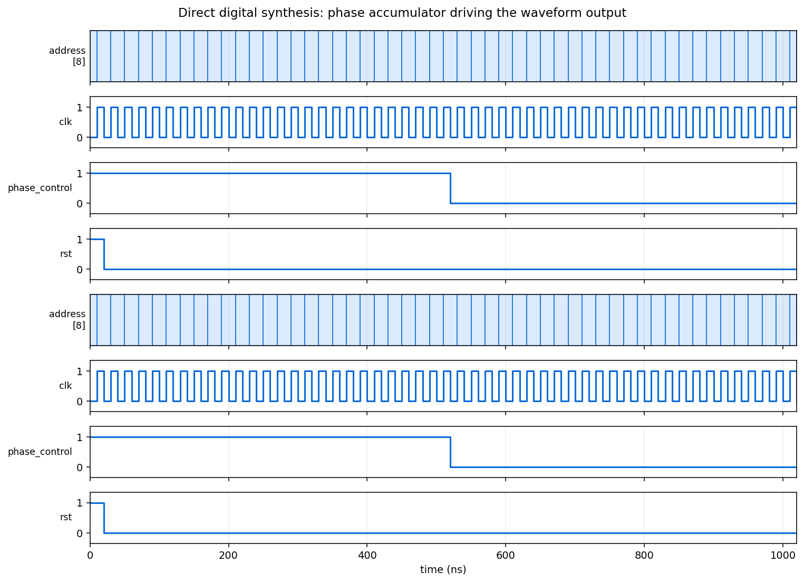

# Digital Logic Laboratory

Board-targeted digital designs in Verilog and SystemVerilog: debouncing and
display driving in one lab, direct digital synthesis in the next.



## Requirements

[Icarus Verilog](https://steveicarus.github.io/iverilog/) and `make`. The Quartus
projects target a DE2 board but nothing here needs them to simulate.

## Simulating

```bash
make sim          # every design with a testbench
make sim-dds      # just one
```

Targets: `sim-counter`, `sim-one-pulse`, `sim-ofsm`, `sim-dds`.

## Lab 2, input conditioning and display

**`one_pulse`** turns a held button into exactly one clock-wide pulse. Without
it a button pressed for a tenth of a second registers as tens of thousands of
events at 50 MHz, so anything counting them counts nonsense.

**`counter`** and **`SevenSeg`** count events and drive a seven-segment display,
decoding a binary value into the seven segment lines.

**`sequence_detector_1011`** is a state machine recognising the bit pattern 1011
in a serial stream, with overlap: the trailing `1` of one match can begin the
next. That is the difference between four states and five, and the reason the
state diagram is worth drawing before writing the code.

**`OFSM`** is an output-driven state machine, where outputs depend on the state
alone rather than on state and input together.

## Lab 3, direct digital synthesis

A waveform generator that produces analogue-looking output from purely digital
parts.

A **phase accumulator** adds a fixed increment to a register on every clock. The
register's value sweeps linearly and wraps, which makes it a phase. Feeding that
phase into a **ROM** of sample values turns it into any waveform the ROM holds,
and the increment sets the frequency: a larger step walks the table faster.

**`Frequency_Selector`** sets that increment, **`Amplitute_Selector`** scales the
output, and **`PWM`** turns the digital value into a duty cycle that an RC filter
smooths into a real voltage.

The waveform above shows the accumulator's address sweeping under `phase_control`
while the adder carries around it.

## Project structure

```
Lab2/Code/
    one_pulse.sv, counter.sv, SevenSeg.sv
    sequence_detector_1011.sv, OFSM.v
    *_TB.sv, *_TB.v          testbenches
Lab3/DLD3/
    DDS.v                    phase accumulator and lookup
    Adder.v, Counter.v, Register.v
    Frequency_Selector.v, Amplitute_Selector.v
    Waveform_Generator.v, PWM.v, exponential.v
    *_TB.v                   testbenches
Lab3/DLD_Quartus/            generated ROM and Quartus project
docs/waveform.png            the figure above
Makefile
```
